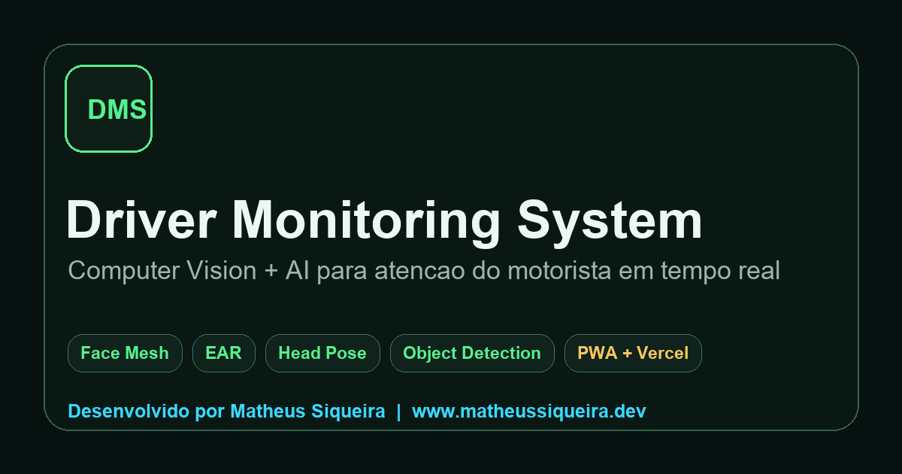

# Driver Monitoring System (DMS)

Sistema de Monitoramento do Motorista em tempo real usando Visao Computacional e IA. O projeto combina uma interface web profissional para portfolio e deploy na Vercel com um pipeline Python/OpenCV local para camera, Face Mesh, Eye Aspect Ratio, Head Pose Estimation, deteccao de celular e score continuo de atencao.



## Desenvolvedor

- Desenvolvido por **Matheus Siqueira**
- Portfolio: [www.matheussiqueira.dev](https://www.matheussiqueira.dev)
- LinkedIn: [matheussiqueira-dev](https://www.linkedin.com/in/matheussiqueira-dev)

Os creditos profissionais fazem parte permanente da interface e da documentacao do projeto.

## Visao Geral

O DMS foi estruturado em duas superficies complementares:

- **Web App estatico**: experiencia de produto para portfolio, com demo visual, camera em tempo real no navegador, Face Landmarker via MediaPipe Tasks Vision, dashboard inteligente, PWA, SEO, analytics e configuracao para Vercel.
- **Engine local Python**: pipeline OpenCV para uso com camera/video, MediaPipe Face Mesh, EAR, solvePnP para pose, YOLO/Ultralytics para celular, MediaPipe Hands como fallback e overlay OpenCV.

Essa separacao preserva o deploy simples na Vercel e evita que `main.py` seja interpretado como uma Python Function, enquanto mantem o pipeline tecnico completo no repositorio.

## Funcionalidades

- Face Mesh em tempo real com landmarks faciais.
- Conversao correta de landmarks normalizados para pixels.
- Mapeamento do overlay considerando tamanho real do video, canvas, `object-fit: cover`, `devicePixelRatio` e espelhamento.
- EAR para sonolencia e microssono.
- Head Pose com yaw, pitch e roll.
- Deteccao de celular por YOLO no pipeline Python.
- Fallback de maos com MediaPipe Hands.
- Attention Score 0-100 com suavizacao temporal.
- Dashboard com KPIs, tendencia, eventos e insights acionaveis.
- PWA instalavel com manifest, service worker, icones e cache offline do app shell.
- SEO tecnico com Open Graph, Twitter Cards, canonical, sitemap, robots e structured data.
- Observabilidade preparada com Vercel Analytics, eventos do DMS, Web Vitals e captura de erros de cliente.
- Headers de seguranca e cache configurados em `vercel.json`.
- Auditoria tecnica versionada em [`docs/PRODUCTION_AUDIT.md`](docs/PRODUCTION_AUDIT.md).

## Arquitetura

```text
Driver-Monitoring-System/
  assets/
    demo.gif
    icon-192.png
    icon-512.png
    og-image.png
  dms/
    attention.py
    camera.py
    config.py
    detection.py
    ear.py
    face_mesh.py
    head_pose.py
    mediapipe_utils.py
    overlay.py
    spatial.py
    utils.py
    visualization.py
  scripts/
    build-static.js
  tests/
  docs/
    PRODUCTION_AUDIT.md
  analytics.js
  app.js
  index.html
  manifest.webmanifest
  pwa.js
  robots.txt
  service-worker.js
  sitemap.xml
  styles.css
  main.py
  vercel.json
```

## Stack

- Frontend: HTML, CSS, JavaScript Modules, Canvas API.
- Web Computer Vision: MediaPipe Tasks Vision Face Landmarker.
- Runtime local: Python, OpenCV, MediaPipe, NumPy.
- Object Detection: Ultralytics YOLO.
- Deploy: Vercel Static Output.
- Qualidade: unittest, build estatico, browser verification.

## Pipeline Python

1. Captura de frame por camera ou video.
2. Espelhamento opcional da camera.
3. MediaPipe Face Mesh para landmarks.
4. EAR para olhos e sonolencia.
5. solvePnP para yaw, pitch e roll.
6. YOLO para celular e MediaPipe Hands como fallback.
7. Fusao no `AttentionScorer`.
8. Overlay OpenCV com malha, boxes, score, metricas e alertas.

## Execucao Local da Interface Web

```bash
npm run dev
```

Abra:

```text
http://localhost:3000
```

Build e preview da versao final:

```bash
npm run build
npm run preview
```

## Execucao Local do DMS Python

Recomendado: Python 3.9 a 3.12.

```bash
python -m venv .venv
.venv\Scripts\activate
pip install -r requirements.txt
python main.py --source 0
```

Selecionar camera pelo nome no Windows:

```bash
python -m pip install pygrabber
python main.py --list-cameras
python main.py --camera-name Brio
```

Rodar com video:

```bash
python main.py --source path/para/video.mp4
```

Opcoes uteis:

```bash
python main.py --source 0 --no-mirror
python main.py --weights pesos_custom.pt --device cuda
python main.py --no-yolo --no-hands --no-mesh
python main.py --no-face-overlay --no-debug-overlay
```

## Variaveis de Ambiente

Nenhuma variavel e obrigatoria para a interface web estatica.

Para observabilidade:

- Vercel Web Analytics deve ser habilitado no dashboard do projeto.
- Speed Insights e carregado por meta tag quando o script da Vercel estiver disponivel para o projeto.
- Google Analytics pode ser conectado futuramente sem alterar a arquitetura, usando o adaptador em `analytics.js`.

## Deploy na Vercel

O projeto usa `vercel.json` com:

- `framework: null`
- `buildCommand: node scripts/build-static.js`
- `outputDirectory: dist`
- rotas limpas para `/monitor`, `/dashboard`, `/arquitetura`, `/produto` e `/sobre`
- headers de cache, seguranca, PWA e service worker

Deploy:

```bash
vercel
vercel --prod
```

Validacao local antes do deploy:

```bash
npm run validate
```

## PWA

O app inclui:

- `manifest.webmanifest`
- icones `192x192` e `512x512`
- service worker com cache do app shell
- suporte a instalacao desktop/mobile
- fallback offline para navegacao principal

## SEO Tecnico

Implementado:

- meta description e keywords
- canonical URL
- Open Graph
- Twitter Cards
- `robots.txt`
- `sitemap.xml`
- structured data `WebApplication`
- imagem social `assets/og-image.png`

## Seguranca

Implementado em `vercel.json`:

- `X-Content-Type-Options`
- `Referrer-Policy`
- `Permissions-Policy`
- `X-Frame-Options`
- `Strict-Transport-Security`
- `Content-Security-Policy`
- cache diferenciado para assets e service worker

## Testes

```bash
python -m unittest discover -s tests
```

Cobertura atual:

- score de atencao
- filtro espacial de celular
- conversao de landmarks normalizados para pixels
- ancora facial
- escala e roll do overlay
- suavizacao EMA
- hold/fade quando a face desaparece

## Roadmap

- Integrar telemetria real via WebSocket ou API.
- Adicionar E2E com Playwright para fluxos Camera/Dashboard/PWA.
- Treinar YOLO customizado com classes `cell phone` e `hand`.
- Adicionar estimativa de gaze.
- Detectar bocejo por abertura de boca.
- Adaptar thresholds por usuario.
- Exportar relatorios de sessoes.

## Aviso

Este projeto e para fins educacionais, demonstrativos e de portfolio. Sistemas automotivos reais exigem validacao extensiva, redundancia, datasets representativos e certificacoes especificas.
